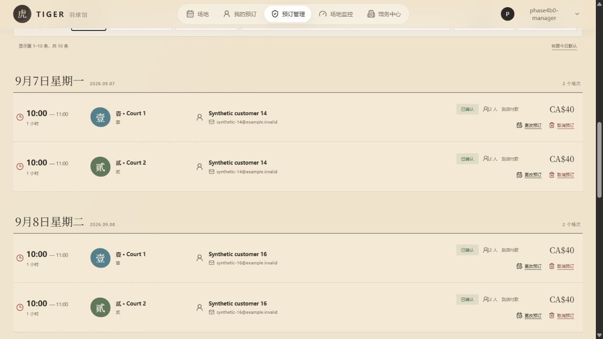
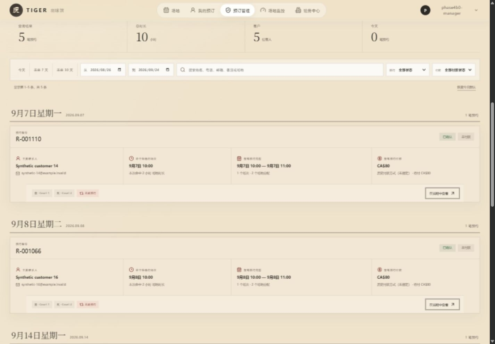
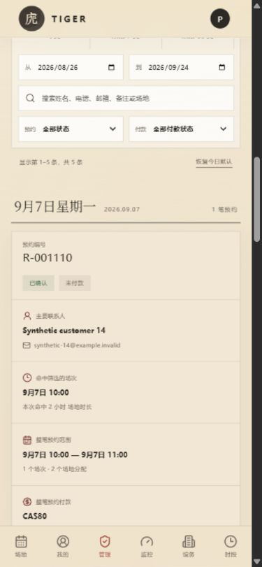
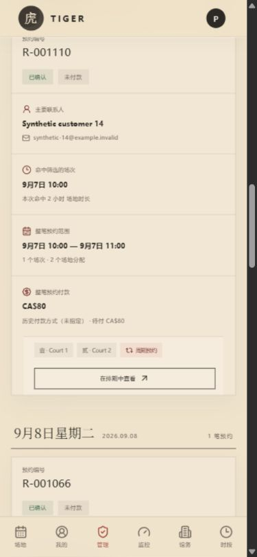

# Reservation Phase 4B.3：Canonical Reservation 订单查询

> 关联 Issue：[#157](https://github.com/tujiaqi2002/badminton/issues/157)
> 当前状态：PR #158 已合并，migration 49 已进入 staging 与 production；production order UI 仍按 selector fallback 使用 legacy。完整发布验证见 [`phase-4b3-default-legacy-production-verification.md`](./phase-4b3-default-legacy-production-verification.md)。
> 范围：馆长订单查询的读取边界、聚合卡片与排期定位。
> 不在范围：生产 migration/cutover、任何 writer/action 改造、客户读取、付款/计价规则、Stripe、Realtime 或 legacy decommission。

## 1. 本阶段解决的问题

旧订单查询以一条 legacy booking / Court allocation 为一行。同一人一次订两块场地时，馆长会看到两条近似订单；后续关联的多日期、多时间订单也无法自然表达为一笔业务预约。

Phase 4B.3 将馆长查询单位改为已经确认的 canonical 模型：

> 一笔 Reservation → 一个或多个 Session → 每个 Session 包含一个或多个 Court allocation；一个 Reservation 可以有多个 Party，并拥有一套付款计划和付款汇总。

因此，同一 Reservation 在查询结果中只出现一次。日期范围负责判断哪些 Session 命中筛选，而订单卡同时展示命中范围和整笔 Reservation 的完整范围，避免把“本次搜索命中的场次”误认为“整笔预约的全部场次”。

## 2. 已接受的产品契约

- 订单列表的一行/一卡单位是 **Reservation**，不是 Court allocation。
- 日期范围匹配 Reservation 内的 Session；同一 Reservation 即使有多个日期、时间、时长或场地，也只返回一次。
- 搜索覆盖 Reservation reference、所有 Party 的姓名/邮箱/电话、Court 名称/说明与 Session notes，不只搜索 primary contact。
- 列表明确显示 primary contact 和其余 Party 数量；不同客户被馆长合并后仍可被任一 Party 搜到。
- 付款状态来自整笔 Reservation 的 append-only payment facts，支持 `unpaid`、`partial`、`paid`、`refunded`、`no_charge` 与显式异常状态；没有把旧 `booking.payment_status` 当作 canonical 真相。
- 当前 canonical 卡片只提供“在排期中查看”。移动、改时长、付款、关联和取消仍属于后续 action-scope 门禁，不能在聚合卡上含糊地调用单 booking writer。
- “在排期中查看”会切到命中的日期/时间并高亮该 Reservation 当天的全部 effective allocations；不会只高亮一块场地。

## 3. 数据库变更

新增 append-only migration：

`20260826181644_reservation_phase_4b3_order_search.sql`

它只 `CREATE OR REPLACE` 已存在的 `public.admin_search_reservations(...)`，保持 version 1 envelope、签名和调用边界不变，并增加：

- 所有 Reservation Party 的匹配；
- 每笔 Reservation 的 `party_count`；
- `(matched_start_at, reservation_id)` keyset pagination；
- venue timezone 日期边界；
- Reservation 状态与 canonical payment 状态白名单；
- 最大 367 天、每页最多 50 条的输入限制；
- 严格的 48-migration / Phase 3B / Phase 4A preflight 与 postflight。

函数继续是 `STABLE`、`SECURITY INVOKER`、空 `search_path`，并在函数内部独立要求 `staff_members.role = 'admin'`。ACL 只允许 `authenticated` EXECUTE；`anon` 和 `service_role` 均没有入口。Migration 不写业务数据、不新增 client DML、不改变 RLS、Realtime publication、Auth、付款或计价事实。

本阶段没有盲目增加索引。查询先以最多 367 天的 Session 范围缩小 Reservation，再对匹配 Reservation 执行 Party/Court/notes 条件；现有 membership/Session/Party 索引和 staging 数据规模足够支撑当前负载。Merge 前已经在 production 以只读候选 SQL 执行 `EXPLAIN (ANALYZE, BUFFERS)`，结果见第 9 节；当前没有新增索引证据。未来只有出现可复现的慢计划时，才用独立 migration 增加有证据的索引。

## 4. 前端读取边界

新增 `VITE_RESERVATION_ORDER_READ_SOURCE`：

- 只有 exact `canonical` 启用 canonical order read；
- 缺失、拼写错误和未知值全部回到 `legacy`；
- `.env.staging.example` 使用 canonical；
- `.env.example` 与 Pages workflow 默认使用 legacy。

`reservationOrderRead.js` 将 RPC DTO 映射为显式 version 1 `AdminReservationOrderViewModel`。它校验 Reservation identity、Party 数量、schedule count/range、Court identity、payment plan/status、金额关系、currency 与 cursor；任何未知枚举、重复 Reservation、金额矛盾或分页矛盾都会 fail closed。

Canonical 请求不会在单次失败后静默读取 legacy 数据，也不会把失败伪装成空结果。新查询会 abort 旧请求，React request identity 会阻止迟到响应覆盖新筛选。Legacy 和 canonical 分页分别保留自己的 cursor/offset 语义。

## 5. 界面行为

Canonical 卡片按一笔 Reservation 展示：

- Reservation reference、Reservation status 与 payment status；
- primary contact、联系方式和其余 Party 数；
- 本次筛选命中的开始时间与 Court 时长；
- 整笔 Reservation 的最早开始、最晚结束、Session 数和 Court allocation 数；
- 整笔 Reservation 的总额、付款计划和 outstanding；
- 涉及的 Courts、recurrence 提示与“在排期中查看”。

桌面为四区摘要；平板自动转为两列；390 px 手机为单列且 action 全宽。新增文案均有中英文。

## 6. Before / After 证据

### 修改前：同一业务预约按 Court 展开为多条 booking row

### 修改后：每笔 Reservation 一张聚合卡

### 手机：单列聚合信息与全宽排期入口

截图只包含 `badminton_stage` 的 synthetic 数据；测试客户使用 `.invalid` 域名，没有生产客户资料或凭据。

## 7. Staging 数据库验证

在确认 Supabase CLI 已链接 `badminton_stage` 后：

- dry-run 只列出 migration 49；
- `db push` 成功，staging 从 48 精确推进到 49，最新为 `20260826181644`；
- 本次 staging 验证时 production 仍为 48；后续经独立授权已由 protected integration 推进到 49；
- canonical 基线仍是 123 Reservations、135 Sessions、192 memberships、131 Parties；
- 年度 manager 查询首屏 50 条，summary 为 83 results / 9,120 minutes，`has_more = true`；
- 使用非 primary 的第二 Party “Synthetic customer 2” 查询，精确返回一笔 Reservation，`party_count = 2`、命中 Court 时长 120 分钟；
- authenticated non-manager 调用被 `Manager access required` 拒绝；
- ACL 核对为 authenticated=true、anon=false、service_role=false。

数据库验证只应用 additive function migration，并执行只读查询；没有修改 synthetic 业务行。

## 8. 浏览器与本地验证

Authenticated staging manager：

- 未来 30 天从 10 条 legacy rows 收敛为 5 张 Reservation 卡；
- 5 张卡均具有 payment badge 和排期入口，legacy inline reschedule/cancel action 为 0；
- 点击首张卡后同时高亮同一 Reservation 的 2 条 allocation；
- primary Party 搜索精确返回 1 笔，secondary Party 的数据库路径也返回同一笔；
- 中英文 desktop 文案完整，未出现 untranslated key；
- 390×844 手机无横向 overflow，卡片单列、action 全宽；
- fresh canonical session 的 console error/warn 为 0。

Authenticated non-manager 页面只显示未授权状态；既没有馆长 UI，也不能绕过数据库 manager gate。

本地使用 Codex Desktop bundled Node `v24.19.0` / pnpm `11.19.0`：

- `pnpm run test:reservation-read`：36/36 pass；
- `pnpm run test:reservation`：37 total、36 pass、1 个明确的 no-local-PostgreSQL contention skip、0 fail；
- `pnpm run lint`：pass；
- `pnpm run build`：pass，只有既有的 >500 kB chunk warning。

仓库 CI 固定 Node 22 / pnpm 11.16.0，与本地 bundled 版本不同；最终生产兼容必须以 PR CI 为门禁。

Draft PR [#158](https://github.com/tujiaqi2002/badminton/pull/158) 首轮 [CI run 33013724851](https://github.com/tujiaqi2002/badminton/actions/runs/33013724851) 在 Node `v22.23.2` / pnpm `11.16.0` / PostgreSQL `16.15` 下通过 Reservation 37/37、read 36/36、0 skip，以及 lint/build。唯一 annotation 是 GitHub runner 对 `pnpm/action-setup@v4` 内部 Node 20 target 的平台弃用提示，不是仓库代码或 Phase 4B.3 测试失败。

## 9. Production 只读 preflight

2026-08-26 在不改变 Supabase link、不执行 merge/db push、且不输出客户 PII 的前提下完成 fresh production preflight：

- production remote history 精确为 48 个 migration，最新 `20260825091608`；remote-only 为 0，唯一 local-only/pending 项是 `20260826181644`；
- `db push --dry-run --skip-vault` 只列 migration 49，没有 seed、role 或其他 migration；
- Phase 3B/4A diagnostic 仍为 192 bookings / memberships / allocations、123 Reservations、所有 projection/payment/incomplete mismatch 为 0、7 个 FORCE RLS 表、17/0/17/3 writer 边界，Realtime 仍只发布 `court_slots`；
- production 当前 search function 仍为 `SECURITY INVOKER`、空 `search_path`、authenticated=true / anon=false / service_role=false；authenticated non-manager 在 read-only transaction 内按预期被 `Manager access required` 拒绝；
- 以未来 30 天、all-Party/Court/notes 无命中条件模拟候选查询的 `EXPLAIN (ANALYZE, BUFFERS)`：execution 9.335 ms、95 shared-hit blocks、0 shared reads、0 temp blocks；使用 `reservation_sessions_admin_window_idx` 和 membership effective-session index，排序只使用 25 kB 内存；
- security advisor 的 48 项和 performance advisor 的 60 项都是既有 baseline，没有 Phase 4B.3-specific finding；当前规模没有新增索引理由，这不是对未来数据量的永久保证。

整个 preflight 都是只读或 dry-run。该门禁结束时 production 仍为 48 migrations、PR #158 仍是 Draft；后续授权、合并与 default-legacy 发布结果见第 10 节。

## 10. 发布、回退与下一门禁

用户在上述门禁后明确授权继续。PR #158 于 2026-08-26 21:26:04 UTC 合并为 `58d9d59cab0eebd6f0591834217e744ecb2343f1`；Supabase integration 成功把 production 精确推进到 migration 49，Pages run 33015339219 同 commit build/deploy 全绿。Production workflow 对 order selector 的 fallback 继续是 `legacy`，本次没有 canonical UI cutover。

后续必须按顺序单独确认：

1. review Draft PR 与 CI（已完成）；
2. fresh production read-only preflight（已完成且 clean）；
3. 明确授权 merge / production migration 49（已完成）；
4. production default-legacy 发布验证（已完成）；
5. 再单独决定是否把 production order selector 设为 exact `canonical`；
6. 最后才重新设计聚合订单上的付款、移动、取消和关系 action scope；legacy decommission 仍属于更晚的 Phase 5。

在 canonical order cutover 后，前端回退只需把 selector 设为 `legacy` 或删除并重新 build；migration 49 保留向后兼容签名，因此不需要数据库回滚。若数据库函数本身出现问题，应通过 append-only follow-up migration 修复，不逆向改写历史。

---

# Reservation Phase 4B.3: Canonical Reservation order search

> Related issue: [#157](https://github.com/tujiaqi2002/badminton/issues/157)
> Current state: PR #158 merged and migration 49 is installed on staging and production; the production order UI still uses the selector's legacy fallback. Full release evidence is in [`phase-4b3-default-legacy-production-verification.md`](./phase-4b3-default-legacy-production-verification.md).
> Scope: manager order-search read boundary, aggregate cards, and schedule focus.
> Excluded: production migration/cutover, writer or action changes, customer reads, payment/pricing rules, Stripe, Realtime, and legacy decommission.

## 1. Problem and adopted model

The legacy order list renders one booking/Court allocation per row. A customer reserving two Courts in one business transaction therefore appears as two nearly identical orders, while linked multi-date schedules cannot be represented naturally.

Phase 4B.3 adopts the confirmed canonical unit:

> One Reservation contains one or more Sessions; each Session contains one or more Court allocations; a Reservation may have multiple Parties and one payment plan/aggregate.

Each Reservation now appears once. Date filters select Reservations through their matching Sessions, while the card separately shows the matched range and the full Reservation range. This prevents a filtered Session from being mistaken for the entire order.

## 2. Accepted product contract

- The order-list unit is a Reservation, not a Court allocation.
- One Reservation may contain different dates, times, durations, and Courts and still appears once.
- Search covers the Reservation reference, every Party's name/email/phone, Court metadata, and Session notes—not only the primary contact.
- The card shows the primary contact plus the number of other Parties, so a merged different-customer Reservation remains searchable through either customer.
- Payment state comes from Reservation-level append-only facts and supports `unpaid`, `partial`, `paid`, `refunded`, `no_charge`, and explicit inconsistency.
- The aggregate card currently exposes only “View in schedule.” Move, resize, payment, relationship, and cancellation scopes require a later writer/action gate.
- Schedule focus navigates to the matched local date/time and highlights every effective allocation for that Reservation on the day.

## 3. Database contract

Append-only migration `20260826181644_reservation_phase_4b3_order_search.sql` replaces only the existing `public.admin_search_reservations(...)` definition. It preserves the version 1 response envelope and signature while adding all-Party matching, `party_count`, venue-local bounds, allowlisted Reservation/payment filters, and `(matched_start_at, reservation_id)` keyset pagination. Inputs are limited to 367 days and 50 rows per page.

The migration has strict 48-version and Phase 3B/4A pre/postflight checks. The function remains `STABLE`, `SECURITY INVOKER`, and empty-search-path, independently verifies `staff_members.role = 'admin'`, and grants EXECUTE only to `authenticated`. `anon` and `service_role` have no entry. No business data, RLS, client DML, Auth, Realtime publication, pricing, or payment fact changes.

No speculative index was added. The query first bounds Sessions to at most 367 venue-local days, then evaluates Party/Court/note matching for the matching Reservations using existing membership, Session, and Party access paths. A read-only production candidate `EXPLAIN (ANALYZE, BUFFERS)` has now been completed before merge; Section 9 records the result. Any future index must still be justified by a repeatable slow plan and delivered in a separate append-only migration.

## 4. Frontend contract and failure behavior

`VITE_RESERVATION_ORDER_READ_SOURCE` enables canonical order reads only for exact `canonical`. Missing, misspelled, and unknown values resolve to `legacy`. Staging opts into canonical; the production example and Pages workflow default to legacy.

`reservationOrderRead.js` maps the RPC DTO into an explicit version 1 `AdminReservationOrderViewModel`. It validates Reservation identity, Party count, schedule ranges/counts, unique Court identities, payment plan/status, monetary reconciliation, currency, and pagination cursors. Unknown enums, duplicate Reservations, contradictory money, or invalid cursors fail closed.

A canonical request failure never silently retries the legacy source or pretends the result is empty. New searches abort obsolete requests, and React request identity rejects late commits. Legacy and canonical pagination retain their own cursor semantics.

## 5. User interface

Each canonical card displays the Reservation reference and status, payment status, primary contact and other-Party count, matched schedule, complete Reservation schedule, aggregate money/plan/outstanding balance, Courts, recurrence, and a schedule-focus action. Desktop uses four summary regions, tablet uses two columns, and 390 px mobile uses one column with a full-width action. All new copy is bilingual.

## 6. Before / After evidence

### Before: one business Reservation expanded into booking rows

### After: one aggregate card per Reservation

### Mobile aggregate card and full-width schedule action

All screenshots use synthetic `badminton_stage` data and `.invalid` customer domains. No production customer data or credentials are included.

## 7. Hosted-stage verification

- The dry run listed only migration 49, and `db push` advanced staging exactly from 48 to 49 with `20260826181644` latest. Production was still at 48 during this stage verification and was later advanced to 49 by the separately authorized protected integration.
- The canonical fixture remains 123 Reservations, 135 Sessions, 192 memberships, and 131 Parties.
- A manager annual search returned 50 first-page items and a summary of 83 results / 9,120 minutes with `has_more = true`.
- Searching through the non-primary Party “Synthetic customer 2” returned exactly one Reservation with `party_count = 2` and 120 matched Court minutes.
- An authenticated non-manager was denied with `Manager access required`.
- Function privileges were authenticated=true, anon=false, service_role=false.

Only the additive function migration and read-only verification queries ran; no synthetic business row was changed.

## 8. Browser and local verification

The authenticated staging manager's future-30-day view changed from 10 legacy rows to five Reservation cards. All five had payment badges and schedule actions, with zero legacy inline reschedule/cancel actions. The first schedule action highlighted two allocations from the same Reservation. Primary-Party search returned exactly one Reservation, the database secondary-Party path returned the same Reservation, English and Chinese copy had no untranslated keys, and 390×844 mobile had no horizontal overflow. A fresh canonical session had zero console errors or warnings.

The authenticated non-manager page exposed no manager UI and could not bypass the database manager check.

Using Codex Desktop bundled Node `v24.19.0` and pnpm `11.19.0`, the read suite passed 36/36; the Reservation suite reported 37 total, 36 pass, one explicit no-local-PostgreSQL contention skip, and zero failures; lint and build passed with only the existing >500 kB chunk warning. Repository CI pins Node 22 / pnpm 11.16.0, so PR CI remains the production-compatibility gate.

Draft PR [#158](https://github.com/tujiaqi2002/badminton/pull/158) first [CI run 33013724851](https://github.com/tujiaqi2002/badminton/actions/runs/33013724851) passed 37/37 Reservation PostgreSQL tests and 36/36 read tests with zero skips, plus lint/build, under Node `v22.23.2`, pnpm `11.16.0`, and PostgreSQL `16.15`. The sole annotation is the GitHub runner deprecation notice for the internal Node 20 target in `pnpm/action-setup@v4`, not a repository-code or Phase 4B.3 failure.

## 9. Production read-only preflight

On 2026-08-26, a fresh production preflight completed without relinking Supabase, merging, pushing the database, or outputting customer PII:

- production has exactly 48 remote-applied migrations with `20260825091608` latest, zero remote-only drift, and only `20260826181644` local-only/pending;
- `db push --dry-run --skip-vault` listed only migration 49, with no seed, role, or additional migration;
- Phase 3B/4A diagnostics remained at 192 bookings/memberships/allocations and 123 Reservations, with zero projection/payment/incomplete mismatches, seven FORCE RLS tables, the 17/0/17/3 writer boundary, and `court_slots`-only Realtime;
- the current production function remains security-invoker, empty-search-path, and authenticated=true / anon=false / service_role=false; an authenticated non-manager was denied with `Manager access required` inside a read-only transaction;
- a future-30-day all-Party/Court/note no-match candidate plan completed in 9.335 ms with 95 shared-hit blocks, zero shared reads or temp blocks, existing Session/membership indexes in use, and a 25 kB in-memory sort;
- 48 security-advisor items and 60 performance-advisor items were existing baseline findings, with no Phase 4B.3-specific issue. Current scale does not justify a new index, but this is not a permanent guarantee for future data volume.

The entire preflight was read-only or dry-run. At the end of that gate production still had 48 migrations and PR #158 remained Draft; the later authorized merge and default-legacy release are recorded in Section 10.

## 10. Rollout, rollback, and next gate

The user explicitly authorized continuing after the merge/production-migration gate was stated. PR #158 merged at 2026-08-26 21:26:04 UTC as `58d9d59cab0eebd6f0591834217e744ecb2343f1`; the Supabase integration advanced production exactly to migration 49, and Pages run 33015339219 passed for the same commit. The production order selector still resolves through the workflow's `legacy` fallback, so this deployment did not cut over the UI.

PR/CI review, production preflight, merge/migration 49, and default-legacy production verification are complete. The next independent gate is deciding whether to set the production selector to exact `canonical`; Reservation-level writer/action scopes come later, and legacy decommission remains a Phase 5 concern.

After a future canonical UI cutover, frontend rollback is setting/deleting the selector and rebuilding. Migration 49 preserves the old function signature and can remain installed; a database defect must be corrected through a new append-only follow-up migration rather than rewriting history.
