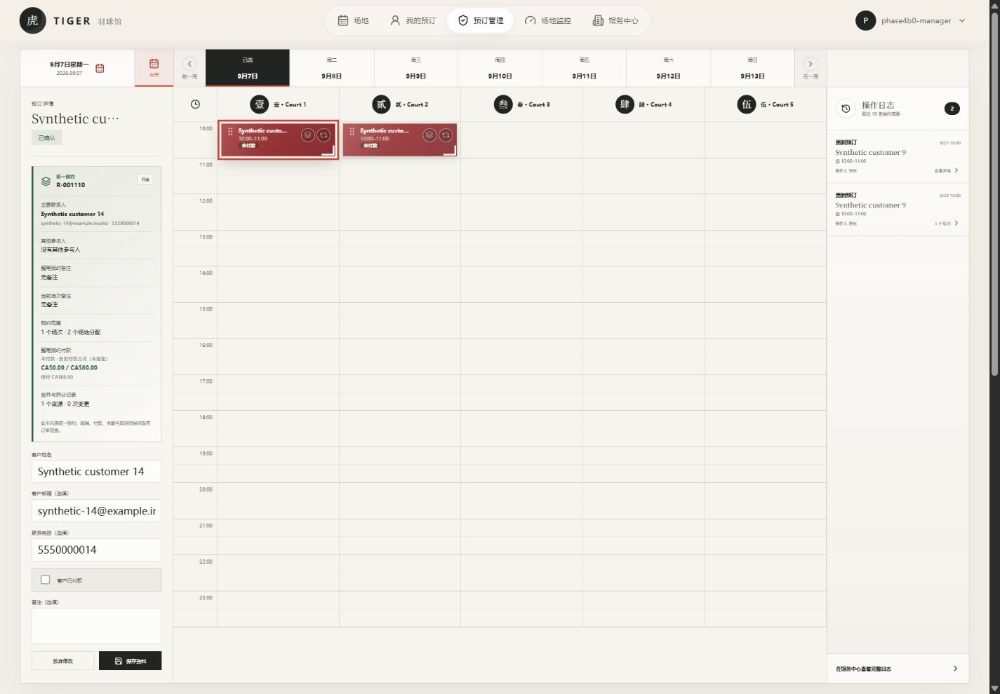
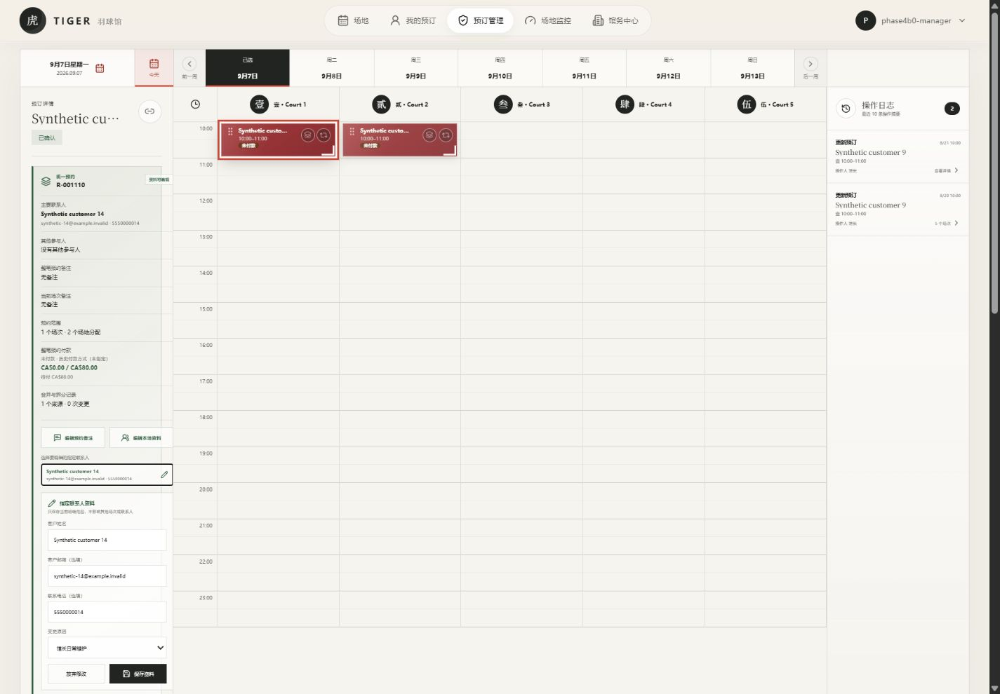
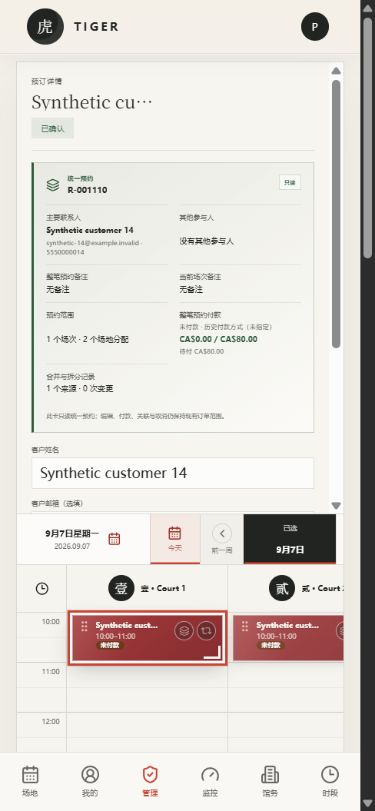
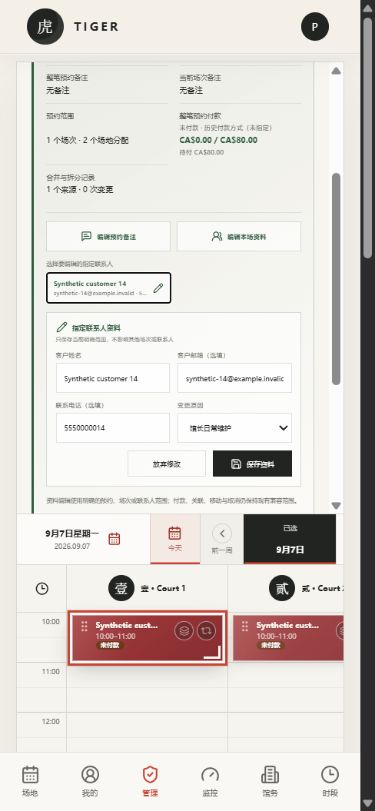

# Reservation Phase 4C.1：Canonical profile mutation

> 关联父 Issue：[#161](https://github.com/tujiaqi2002/badminton/issues/161)
> 实现 Issue：[#162](https://github.com/tujiaqi2002/badminton/issues/162)
> 当前状态：两条 append-only migration 已进入独立 `badminton_stage` 并完成事务回滚验证；production 保持 49 migrations，production profile selector 保持 `legacy`。
> 范围：馆长显式修改 Reservation notes、Session notes / party size，以及指定 Party 的姓名、邮箱、电话。
> 不在范围：移动、改时长、取消、付款、计价、merge/split、primary-contact 角色、客户写入、Realtime 或 legacy decommission。

## 1. 已冻结的产品契约

Phase 4C.1 只提供一个公共馆长 RPC，但每次调用必须显式给出 `scope`、目标 ID、patch、reason、idempotency key 与 `expected_updated_at`。三个 scope 互不混用：

| Scope | 允许修改 | 明确禁止 |
| --- | --- | --- |
| `reservation` | Reservation notes | Session 字段、Party PII、状态、排期、价格、付款 |
| `session` | Session notes、party size | Reservation notes、Party PII、场地、开始/结束时间 |
| `party` | 指定 Party 的 display name、email、phone | 隐式 primary contact、role、付款人、merge/split |

Patch 使用严格 allowlist；空 patch、未知字段、超长 notes/联系方式、无效 email、`party_size` 超出 1–8 均 fail closed。Reason 只能是 `manager_maintenance`、`customer_request`、`data_correction` 或 `onsite_operation`。所有新增界面文案均提供中文和英文。

## 2. 数据库实现

本阶段新增两条 append-only migration：

- `20260827084719_reservation_phase_4c1_profile_mutation.sql`
- `20260827090512_reservation_phase_4c1_party_lineage.sql`

第一条安装 profile mutation 的公共入口、私有更新 helper 与 PII-free audit helper。第二条把 Party 更新解析为双向 transition graph，使馆长即使从 merge/split 后没有 `legacy_booking_group_id` 的 current Party 发起修改，也能同步更新该 lineage 内的 canonical Party 副本与对应 legacy booking projection。

公共 `public.admin_update_reservation_profile(...)` 为 `SECURITY DEFINER`、固定空 `search_path`，并在解析目标或返回业务信息前先验证 `auth.uid()` 对应 `staff_members.role = 'admin'`。只有 `authenticated` 拥有 EXECUTE；`anon`、`service_role` 与 `PUBLIC` 均被撤销。私有 helper 没有 client EXECUTE，核心表也没有新增 authenticated/anon 直接 DML。

数据库在同一事务内锁定目标，随后再次检查 `expected_updated_at`。版本不匹配返回安全的 stale code，防止两个馆长互相覆盖。相同 idempotency key 与相同 payload 重试返回第一次成功结果；key 被不同 payload 复用会拒绝。对 Party lineage 出现不完整或无法安全投影的 split 状态会 fail closed，不猜测身份或角色。

## 3. 响应与审计边界

RPC 只返回统一的 PII-free envelope：版本、operation ID、scope、目标 ID、结果状态和新 `updated_at`。响应、错误与 operation summary 都不回显姓名、邮箱、电话或 notes。

审计保存作用域、目标、reason、changed fields、调用者和 operation identity；changed fields 只记录字段名，不记录旧值或新值。现有 compatibility trigger 可以继续产生额外低层事件，因此验证要求每次成功操作恰好存在一条对应的 profile summary，而不是假设整笔事务只产生一条审计记录。

## 4. 前端门禁

新增 `VITE_RESERVATION_PROFILE_WRITE_SOURCE`：

- 只有 profile selector 与 selected-detail selector **同时**为 exact `canonical` 才启用 canonical profile editor；
- 缺失、拼写错误、未知值，或 detail 仍为 legacy 时都回到 legacy editor；
- `.env.staging.example` 选择 canonical；
- `.env.example` 和 Pages workflow 缺省为 `legacy`。

Canonical 编辑器把 Reservation、Session 与显式 Party 三类动作分开。馆长必须先选择作用域和 reason；Party scope 必须点选具体联系人，不会隐式选择 primary contact。成功后失效 canonical detail cache，并刷新排期、订单和审计；stale/error 会保留安全错误并提供重新加载，不会静默落回 legacy writer。

网络失败或可重试的忙碌响应会复用同一个 idempotency key；浏览器只接受 allowlist 内的 PII-free 响应字段。旧的混合资料表单只有在 profile selector 实际为 legacy 时保留。

## 5. Staging 数据库验证

`badminton_stage` 从 49 精确推进到 51，最新版本为 `20260827090512`；production 仍为 49，且没有 Phase 4C.1 function。Hosted Supabase PostgreSQL 17.6 上完成：

- Reservation、Session、Party 三个 scope 成功；
- 同 key / 同 payload 幂等重试；
- stale version、非法 patch 与 non-manager 安全拒绝；
- 合成真实 merge 后，从没有 legacy group ID 的 current Party 反向穿过 transition graph 更新 canonical lineage 与 legacy projection；
- 所有 mutation 验证均在事务中回滚，最终 profile operation/audit/transition 测试增量为 0；
- Phase 3B、Phase 4A、incomplete-operation 与 `court_slots`-only Realtime diagnostic 保持 clean。

Staging advisor 相对安装前只增加一条预期 security warning：authenticated 可执行的 `SECURITY DEFINER` 公共函数。这里属于有意的最小权限 RPC 边界，而不是客户端直写；manager auth、空 `search_path`、authenticated-only ACL 与私有 helper 拒绝 client EXECUTE 均已单独验证。Advisor 规则见 [Supabase `0029_authenticated_security_definer_function_executable`](https://supabase.com/docs/guides/database/database-linter?lint=0029_authenticated_security_definer_function_executable)。Performance advisor 没有新增 finding。

## 6. 浏览器证据

修改前，legacy editor 把联系人、人数、付款状态和 notes 混在同一表单：

修改后，canonical editor 按 Reservation、Session、指定 Party 分开，并要求 reason：

手机布局也保留显式 scope 与 Party selector：

截图只包含 `badminton_stage` synthetic 数据。中英文桌面与 390×844 手机检查覆盖三个 scope、四个 reason、Party 三项联系方式、canonical/legacy 门禁和响应式布局；没有通过浏览器提交持久 mutation。

## 7. 本地验证与环境差异

使用 Codex Desktop bundled Node `v24.19.0`、pnpm `11.19.0` 与 Vite `6.4.3` 运行验证：Reservation read suite 42/42；Reservation migration suite 41 total / 39 pass / 2 个 no-local-PostgreSQL skip / 0 fail；lint 与 build 通过。Build 只有既有的 500 kB bundle-size warning。真实 PostgreSQL 并发用例在没有 `PHASE3B_POSTGRES_URL` 的本机明确 skip；锁、stale 与 idempotency 已由 hosted staging 事务测试覆盖，但 CI 仍需在仓库规定的 PostgreSQL 16 环境运行该并发用例。

仓库 CI 固定 Node 22、pnpm 11.16 和 PostgreSQL 16；staging 为 PostgreSQL 17.6。本地与 staging 通过不能替代 CI 或 production preflight。

## 8. 发布与回退门禁

本阶段 Draft PR 不能自动视为 production 授权。仓库的 Supabase integration 会在 migration PR merge 后应用 pending production migrations，因此 **Ready/merge 本身就是 production DB deployment gate**，必须另获用户明确授权。

生产若未来获准安装 migration，Pages 仍会因 selector 默认 `legacy` 而保留旧 editor。Production canonical profile cutover 需要再做独立 preflight、设置 exact selector、发布和真实馆长观察。紧急 UI 回退只需把 profile selector 设为 `legacy`/删除并重新构建；两条数据库 migration 是 additive，不能回写或删除生产历史。
