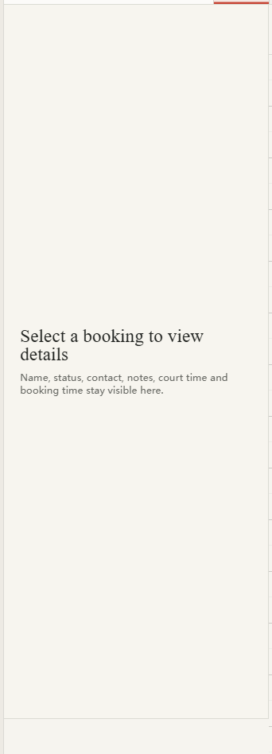
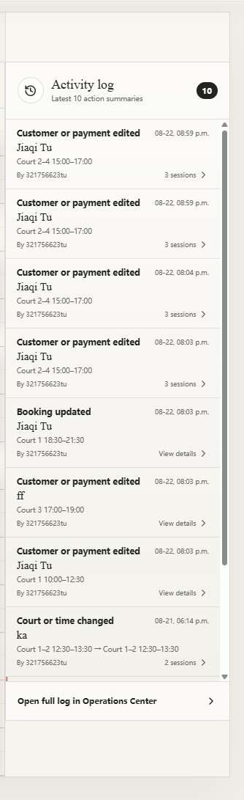
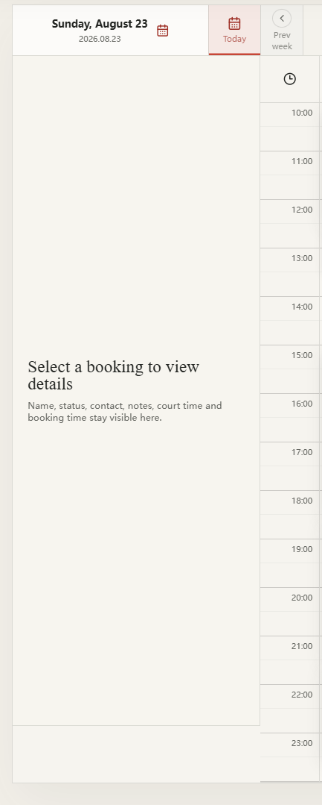
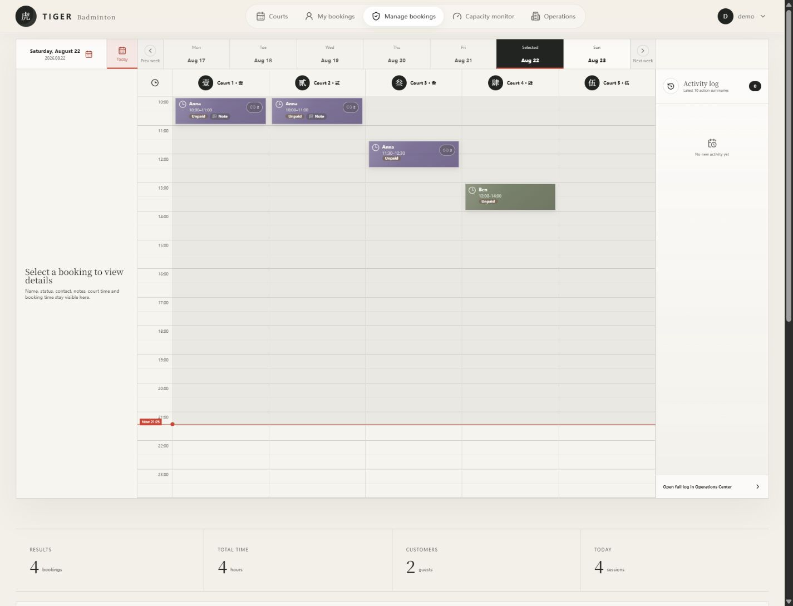
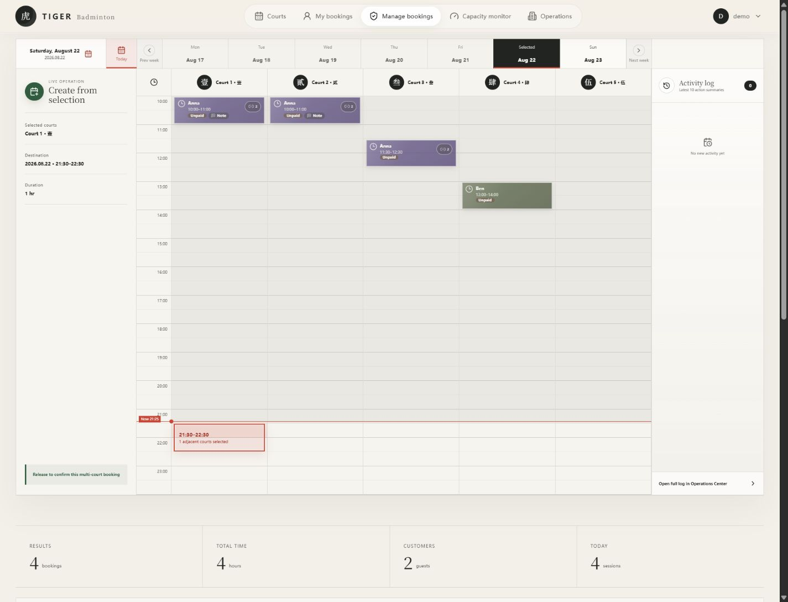
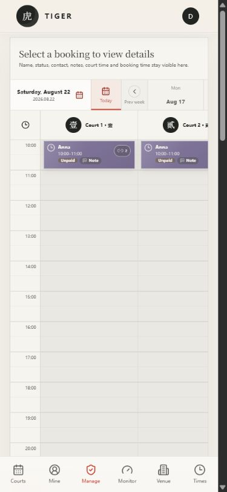
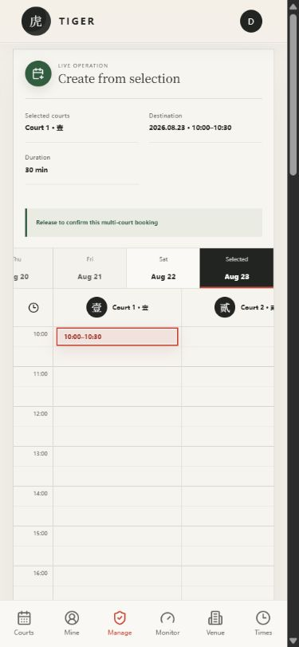

# Issue #116 visual verification

## Before

Temporary full-width drag banner:

Fixed-height desktop detail and activity panels:

Mobile/cropped layout reference:

## After

Desktop panels aligned to the complete schedule-grid height:

Desktop range drag with live operation details in the left inspector and no full-width banner:

Compact 390px mobile idle layout:

390px mobile range drag with the inspector expanded for live details:

